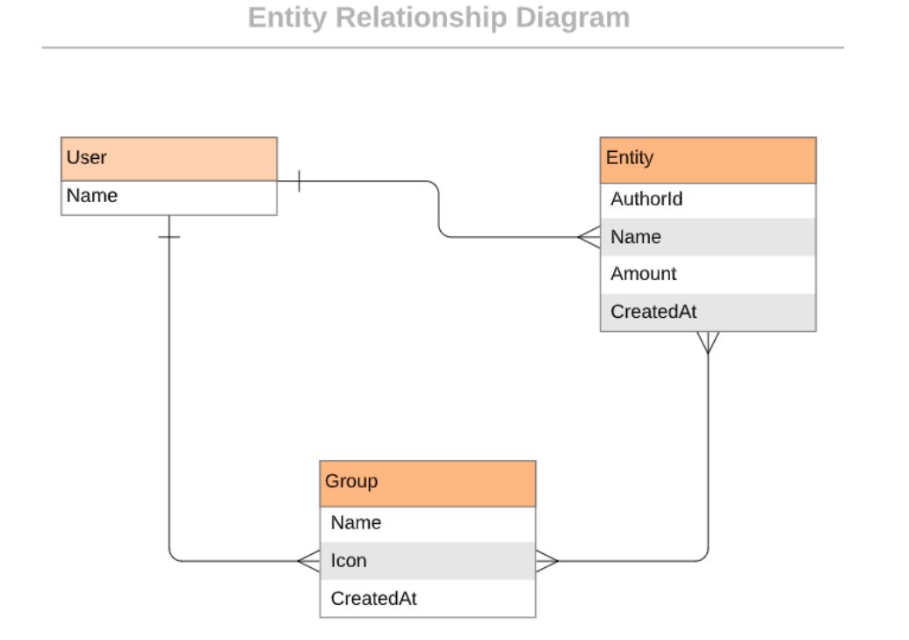

<a name="readme-top"></a>

<h1><b>Budget App</b></h1>

# 📗 Table of Contents

- [📖 About the Project](#about-project)
  - [🛠 Built With](#built-with)
    - [Tech Stack](#tech-stack)
    - [Key Features](#key-features)
- [💻 Getting Started](#getting-started)
  - [Prerequisites](#prerequisites)
  - [Setup](#setup)
  - [Install](#install)
  - [Usage](#usage)
  - [Run tests](#run-tests)
- [👥 Authors](#authors)
- [🔭 Future Features](#future-features)
- [🤝 Contributing](#contributing)
- [⭐️ Show your support](#support)
- [🙏 Acknowledgements](#acknowledgements)
- [📝 License](#license)

# 📖 **BUDGET BUDDY** <a name="about-project"></a>

> A **BUDGET BUDDY** is a mobile web application where you can manage your budget: you have a list of transactions associated with a category, so that you can see how much money you spent and on what.

> To know more about the app, watch this [Video Presentation](https://drive.google.com/file/d/15xbmuU3o9ElexqBmzX12OQOQS2WAlvBB/view?usp=sharing) !

> [Live Demo Link](https://budget-application-xjpp.onrender.com/) of the app !

> ER Diagram of the Project


## 🛠 Built With <a name="built-with"></a>

### Tech Stack <a name="tech-stack"></a>

> This application is built on Ruby on Rails and PostgreSQL as a Database.

<details>
  <summary>Ruby</summary>
  <ul>
    <li><a href="https://www.ruby-lang.org/en/">Ruby - A Programmer's Best Friend</a></li>
  </ul>
</details>

<details>
  <summary>Ruby on Rails</summary>
  <ul>
    <li><a href="https://guides.rubyonrails.org/">Ruby on Rails</a></li>
  </ul>
</details>

<details>
<summary>Database</summary>
  <ul>
    <li><a href="https://www.postgresql.org/">PostgreSQL</a></li>
  </ul>
</details>

### Key Features <a name="key-features"></a>

> - **Register and Log In, so that the data is private**
> - **Introduce new transactions associated with a category**
> - **See the money spent on each category**
> - **Able to add a new category**
> - **Able to add a new transaction**

<p align="right">(<a href="#readme-top">back to top</a>)</p>

## 💻 Getting Started <a name="getting-started"></a>

> To get a local copy up and running, follow these steps.

### Prerequisites

> In order to run this project you need:
> - Download and Install [Ruby](https://www.ruby-lang.org/en/downloads/) for your OS.
> - Download and Install [PostgreSQL](https://www.postgresql.org/download/)
> - VS Code
> - Ruby on Rails
```sh
  gem install rails
```

### Setup

> Clone this repository to your desired folder:
```sh
  git clone https://github.com/anita00001/budget-app.git
```
```sh
  cd budget-app
```

### Install

> Install this project with:
```sh
  gem install
```

```sh
  bundle install
```

### Usage

> To run the project, execute the following command:
> - Drop the previously existing database of same name
```sh
  rails db:drop
```
> - Create database and Migrate
```sh
  rails db:create db:migrate
```
> - Feed Sample data through seeds
```sh
  rails db:seed
```
> - Run the server
```sh
  rails server
```

### Run tests

> - To run Rubocop checker, run the following command:

```sh
  gem install rubocop
```
```sh
  rubocop
```

> - To run Stylelint checker, run the following command:
```sh
  npm install
```
```sh
  npx stylelint "**/*.{css,scss}"
```

## 👥 Authors <a name="authors"></a>

👤 **Anita Sharma**

> - GitHub: [@anita00001](https://github.com/anita00001)
> - LinkedIn: [anitaa-sharmaa](https://www.linkedin.com/in/anitaa-sharmaa/)
> - Twitter: [@anitaa_sharmaa](https://twitter.com/anitaa_sharmaa)

<p align="right">(<a href="#readme-top">back to top</a>)</p>

## 🔭 Future Features <a name="future-features"></a>

> - **UX improvements: transitions and/or animations**
> - **Desktop design for the webapp**
> - **Implement the left side menu to improve the navigability of the app**

<p align="right">(<a href="#readme-top">back to top</a>)</p>

## 🤝 Contributing <a name="contributing"></a>

> Contributions, issues, and feature requests are welcome!

> Feel free to check the [issues page](https://github.com/anita00001/budget-app/issues).

<p align="right">(<a href="#readme-top">back to top</a>)</p>

## ⭐️ Show your support <a name="support"></a>

> ⭐ If you like this project, you can appreciate us by giving star ⭐

> 🚀 Follow us on [GitHub](https://github.com/anita00001), [LinkedIn](https://www.linkedin.com/in/anitaa-sharmaa/), and [Twitter](https://twitter.com/anitaa_sharmaa) 🙏🤗

<p align="right">(<a href="#readme-top">back to top</a>)</p>

## 🙏 Acknowledgments <a name="acknowledgements"></a>

> I would like to thank Microverse for providing this opportunity to build this project. Also, I extend my sincere gratitute to Code Reviewers who encourage and support to build this application more effieiently.

> [CC Licenses](https://creativecommons.org/licenses/by-nc/4.0/): I would thank [Gregoire Vella](https://www.behance.net/gregoirevella) for the original design idea.

<p align="right">(<a href="#readme-top">back to top</a>)</p>

## 📝 License <a name="license"></a>

This project is [MIT](./MIT.md) licensed.

<p align="right">(<a href="#readme-top">back to top</a>)</p>
